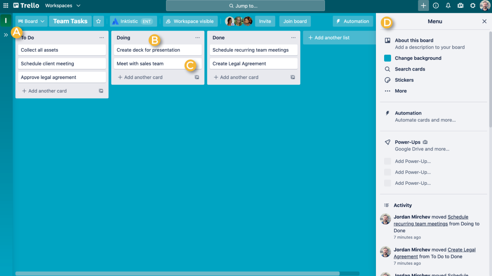
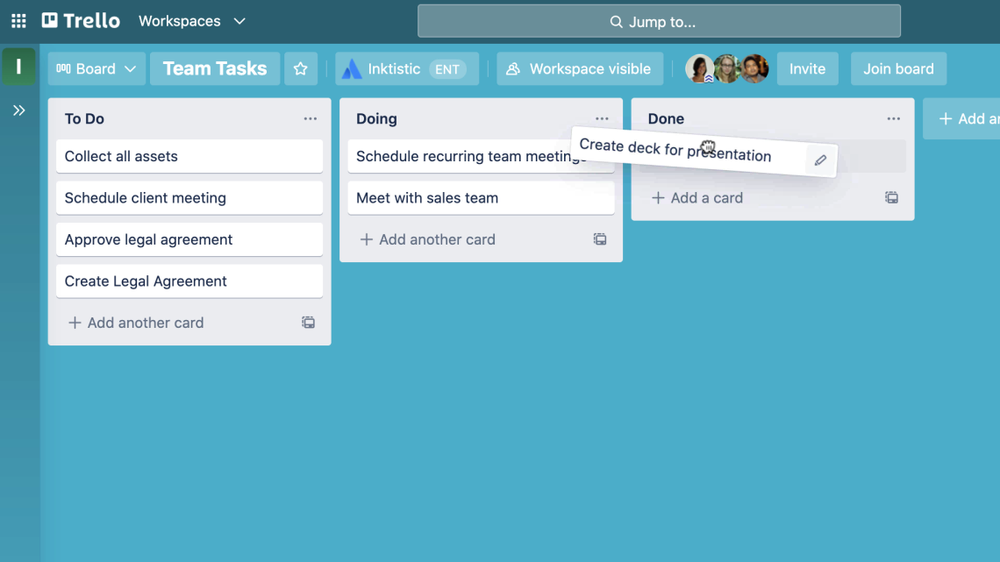
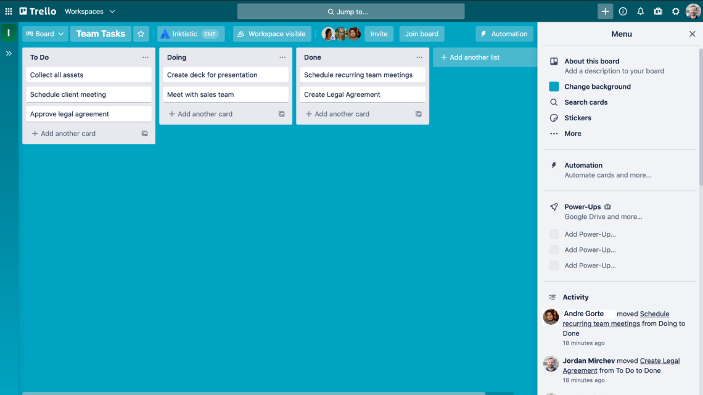

# ¿Qué es Trello? 

Videos:
https://www.youtube.com/watch?v=4dqYvFLfFMI

Trello es **un software de oficina diseñado para la gestión de actividades y la administración de proyectos de manera colectiva**. Este programa informático está optimizado para organizar información en formatos visuales simples que facilitan la realización de tareas y el cumplimiento de objetivos. 

## ¿Para qué sirve Trello? 

El objetivo principal de Trello puede resumirse en una única tarea: **proveer una herramienta para la organización de la información**. Esta plataforma está optimizada para hacer más sencillas las tareas de los equipos de trabajo.  

Mediante una interfaz interactiva, **los usuarios pueden acceder a información ordenada sobre un proyecto, un plan de trabajo o una meta a cumplir**. Por ello, Trello funciona a través de la creación de medios de comunicación inteligentes e intuitivos basados en visualizaciones claras de los datos que se intentan transmitir. 

Entre sus principales funcionalidades podemos destacar:  

* Facilita la organización y la información por medio de recursos visuales. 
Ayuda en la gestión de pequeñas y grandes tareas. 

* Cuenta con recursos creativos, como herramientas de lluvia de ideas. 

* Auxilia en la concreción de objetivos y la ejecución de planes de trabajo. 

 * Da cuenta del progreso en el cumplimiento de un plan.  

* Permite el acceso a un plan de trabajo a diferentes usuarios. 

## ¿Cómo funciona Trello? 

Trello funciona a través de una plataforma de formato web, en la que los usuarios pueden vaciar información y recursos multimedia, y organizarla de diversas maneras. Esta organización se visualiza a partir de **tarjetas** virtuales que pueden arrastrarse y situarse en **tableros** accesibles desde la plataforma web o desde aplicaciones móviles en los llamados **espacios de trabajo**, que son similares a oficinas virtuales. 

En estas **tarjetas** los usuarios pueden indicar las características de una tarea a cumplir, los requisitos o pasos a seguir y las fechas límite para la entrega de los resultados de la asignación. Incluso pueden registrarse conversaciones e interacciones entre los miembros del equipo. 

Para organizar la información dentro de los tableros, la plataforma pone a disposición de sus usuarios plantillas prediseñadas que han sido desarrolladas por expertos y, por tanto, están optimizadas para diferentes actividades, objetivos o, incluso, sectores productivos. Además, el sistema permite la inclusión de otras herramientas, como checklists (o listas de pendientes), cronogramas, calendarios o mapas. 

A pesar de contar con un plan gratuito, diseñado específicamente para grupos pequeños que realizan pocas y sencillas tareas, Trello ofrece tres distintos tipos de suscripciones que permiten aprovechar al máximo todas sus herramientas. Estos planes son:  

**Standard**: la suscripción básica al programa incluye tableros ilimitados, donde los usuarios pueden disponer todas las tarjetas de información que requieran. Además, proveen campos personalizados y un almacenamiento ilimitado. Sin embargo, solo permite que existan colaboradores e invitados exclusivos por cada tablero, lo que limita la eficiencia en la gestión de acceso y responsabilidades a múltiples proyectos. Este plan tiene un costo de 5,00 USD al mes por usuario. 

**Premium**: este plan cuenta con todas las ventajas del plan standard, pero añade algunas importantes funcionalidades más. Los suscriptores premium pueden añadir paneles, cronogramas, calendarios, mapas y algunas funciones de administración y seguridad. Además, permite crear colecciones de tableros que son accesibles para distintos departamentos o grupos de trabajo. Este plan tiene un costo de 10,00 USD al mes por usuario y está limitado a un máximo de 100 colaboradores. 

**Enterprise**: el paquete empresarial incluye todos los beneficios de los anteriores planes, pero añade espacios de trabajo ilimitados, invitados multitableros, inclusión de archivos adjuntos y tableros organizacionales. Este plan tiene un costo de 17,50 USD al mes por usuario y no tiene límite respecto al número de colaboradores. 
7 consejos para aprovechar Trello al máximo:

1. Utiliza las soluciones prediseñadas 
Trello ofrece para todos sus usuarios, gratuitos o de paga, una serie de soluciones prediseñadas que facilitan la creación de tarjetas y tableros, y la organización de ideas para cada sector productivo. Las utilidades de Trello incluyen técnicas recomendables y estrategias de integración para facilitar las labores de los diversos grupos de trabajo de una empresa. Estos son:  

* Equipos de diseño, para quienes la presentación visual con estilo es fundamental. 

* Equipos de ingeniería y desarrolladores, que pueden integrar códigos en sus proyectos. 

* Equipos de recursos humanos, que pueden gestionar el desempeño laboral desde la plataforma. 

* Equipos de marketing, para dar el paso de las ideas a la acción en el mismo espacio. 

* Equipos de gestión de productos, para ejecutar proyectos de manera centralizada. 
Equipos remotos, con técnicas para el teletrabajo y la comunicación en sistemas laborales novedosos. 

* Equipos de ventas, optimizados para el desarrollo de planes de negocio. 

* Equipos emergentes, que llevan paso a paso a las nuevas empresas a cumplir sus primeros objetivos.

* Equipos de soporte, que pueden promover una mejor experiencia al cliente. 

* Equipos de gestión de talento optimizados para administrar la búsqueda, valoración y contratación de personal mediante la coordinación de actividades. 

* Personal productivity, enfocado en el desempeño y productividad personal. 

Aprovecha estas herramientas para comenzar a utilizar Trello. Sus soluciones se adaptan a tus necesidades sin tener que invertir demasiado tiempo a explorar todas las funciones de la plataforma. 

2. Incluye Power-Ups 
Ejemplos de los mejores Power-Ups creados por Trello

<< Gestiona proyectos profesionales de manera eficaz [Guía Gratis] >> 
Los **Power-Ups** son herramientas que pueden integrarse en los tableros de Trello para potenciar las funcionalidades del sistema y ampliar la información de la que disponen los usuarios. 

Estas herramientas funcionan como aplicaciones que pueden añadirse a la interfaz de nuestros espacios de trabajo, con el fin de incluirlas en los tableros y tarjetas.

Entre los **Power-Ups** que ofrece Trello destacan:  

**Twitter**: especialmente útil para adjuntar tweets y retener la atención de los miembros del equipo. 

**SurveyMonkey**: facilita la integración de encuestas del famoso sitio de análisis de datos. 

**Voting**: herramienta habilitada para crear votaciones entre los usuarios de un tablero. 

**OneDrive**: excelente aliado para expandir la información disponible y permitir el acceso a archivos y otros contenidos. 

**Google Hangouts**: permite integrar botones de videollamada en los tableros. 

**Evernote**: para aquellos que quieren añadir notas en el espacio del trabajo. 
Algunas de estas herramientas no han sido creadas por Trello, por lo que puedes encontrar Power-Ups diseñados por terceros. Aprovecha la experiencia de otros usuarios y utiliza los mejores instrumentos para planificar tus proyectos. 

3. Ordena tus tableros 
El orden es fundamental para poder ejecutar las ideas. A pesar de que la organización es la tarea de Trello y esta plataforma está diseñada para facilitarla, existen algunas preferencias personales que pueden mejorar la experiencia de uso. 

**Para organizar tus tarjetas y tableros puedes establecer bloques temáticos o disponer la información en conjuntos de ideas**. La interfaz de Trello está diseñada para seleccionar y arrastrar las tarjetas, por lo que esta tarea es especialmente sencilla. 

Si tu tablero está lleno de información puedes hacer más eficiente la organización de ideas mediante la creación de otros tableros destinados a temas o proyectos específicos. Esto te permitirá tener mayor claridad y establecer las relaciones entre tableros, en lugar de hacerlo entre tarjetas. 

Recuerda que la interfaz de Trello permite hacer cambios en el diseño y el formato, por lo que puedes asignar colores o, incluso, un fondo a cada uno de tus tableros y espacios de trabajo, para que sea más fácil identificar las tareas y pendientes. 

4. Comparte tus ideas 
Interfaz de selección y descarga de plantillas en Trello
Como hemos revisado, Trello ofrece soluciones aptas para cada sector productivo con consejos y técnicas que pueden ser útiles para comenzar el trabajo en la plataforma. Sin embargo, los usuarios son completamente libres de utilizar otras plantillas o crear sus propios diseños. 

Trello ofrece un amplio catálogo de plantillas prediseñadas que facilitan la selección de herramientas y la configuración de un estilo eficiente. Estos formatos no son generados por Trello; en cambio, los usuarios pueden enviar sus propias plantillas para que el público acceda a ellas y las utilice. Es probable que otra persona ya se haya enfrentado al mismo problema que tu empresa, por lo que puedes aprovechar su experiencia para solucionar tu planificación. 

Por otro lado, es recomendable que compartas tus ideas de diseño y mejoras a las plantillas existentes, así pones a disposición de todos los usuarios nuevos modos de trabajo y experiencias de los que cualquiera pueden obtener provecho. Trello es una gran comunidad de trabajadores, líderes y empresarios, por lo que puede resultar realmente útil crear puentes de interacción. 

5. Aprovecha la función de archivo 
El desorden es el enemigo de la buena estructura. Sin embargo, al generar un plan de trabajo es probable que hayas concebido más ideas de las que puedes implementar o que hayan surgido soluciones a otros problemas. 

Si este es tu caso y has creado demasiadas tarjetas o tableros, tal vez te sientas inclinado a eliminar la información y centrarte en la tarea actual. Para no perder estas ideas puedes optar por archivar aquellos elementos que estén creando ruido en tu planificación o en el cumplimiento de las tareas. 

La opción **Archivar** permite a los usuarios conservar los datos ingresados, sin correr el riesgo de borrarlos permanentemente. Esto te ayudará a no desechar buenas ideas y a volver a ellas cuando quieras. 

6. Personaliza tus tarjetas 
Personalizar nuestras interfaces de trabajo es fundamental si queremos aligerar la carga de nuestras labores. En muchos casos, añadir un gesto personal o adaptar nuestro espacio de trabajo de acuerdo con nuestros gustos puede ser un gran incentivo para la motivación y el buen ánimo. Por ello, Trello ofrece algunas herramientas que permiten dar un toque personal a los espacios de trabajo virtuales. 

Una popular herramienta en Trello es la opción de agregar stickers. Estas imágenes, similares a las utilizadas en las plataformas de redes sociales, pueden añadirse a cualquier tarjeta para darles un toque dinámico y divertido a tus tareas. Asimismo, Trello cuenta con un Power-Up optimizado para Giphy. Como puedes imaginar, esta funcionalidad te permite incluir GIFs en tus tableros. 

Paralelamente, puedes optar por formatos tipográficos más tradicionales, como la inclusión de cursivas o negritas. Estos estilos pueden modificarse en el cuadro de descripción en lenguaje Markdown, de acuerdo con los siguientes códigos:  

Negritas: poner el texto entre un par de asteriscos (**palabra**) 
Cursivas: poner el texto entre asteriscos (*palabra*) 
Código: poner el texto entre apóstrofos ('palabra') 
Hipervínculo: poner el texto entre corchetes ([palabra]) 

7. Prueba las vistas disponibles  
Muchas veces pensamos que la mejor alternativa es optar por las versiones gratuitas de un programa, pues no conllevan costos operativos y ofrecen las suficientes herramientas para cumplir con nuestros objetivos. Sin embargo, algunas herramientas pueden ofrecer soluciones inmejorables con el pago de una tarifa. Trello es una de estas herramientas. 

Los costos de la plataforma pueden considerarse un gasto, pero las funcionalidades que ofrece superan con creces la inversión a una suscripción. Los planes Premium y Enterprise ofrecen herramientas realmente útiles llamadas «Vistas» estas te permiten incluir calendarios, listas avanzadas, cronogramas y otros muchos recursos que facilitan la gestión de actividades. 

Trello ofrece una prueba gratuita del plan Premuim que no debes perderte. Si las herramientas adicionales que ofrece no te satisfacen, puedes optar por el plan estándar o por la versión gratuita. Sin embargo, al utilizarla te darás cuenta de que no necesitarás muchos programas para planificar tareas y que todo lo que necesitas está dentro del mismo software. 

Ahora que conoces este potente programa estás preparado para dar tus primeros pasos en el uso de sistemas que facilitan la gestión de tareas y la organización de información. Apóyate en estas herramientas para optimizar la planificación de tus objetivos y asegura el éxito a través de la colaboración entre los miembros de tus equipos de trabajo.

## ¿Qué es un tablero?

Un tablero ("A") representa el lugar donde puedes hacer un seguimiento de la información, normalmente sobre proyectos grandes, equipos o flujos de trabajo. Si tienes que lanzar un sitio web nuevo, supervisar las ventas o planificar la próxima fiesta de la oficina, los tableros de Trello son el sitio perfecto, ya que permiten organizar tareas y cualquier pequeño detalle y, lo que es más importante, colaborar con los compañeros.

Vista de un tablero de Trello.

## ¿Qué es una lista?
Las listas ("B") contienen tarjetas, es decir, tareas o información específica, que están organizadas por fases de progreso. Las listas se pueden usar para crear flujos de trabajo, donde las tarjetas van avanzando por los distintos pasos del proceso de principio a fin, o bien para llevar un seguimiento de ideas e información. Puedes añadir tantas listas como quieras a un mismo tablero, así como organizarlas y ponerles el nombre que quieras.

Vista de una lista en un tablero de Trello
](images/listas.png)

## ¿Qué es una tarjeta?

Una tarjeta ("C") es el elemento más pequeño y, a la vez, más detallado de un tablero, y sirve para representar tareas e ideas. Una tarjeta puede ser una tarea (como escribir una entrada de blog) o un recordatorio (como las políticas de vacaciones de la empresa). Para crear una tarjeta, haz clic en "Añadir una tarjeta…" en la parte inferior de cualquier lista y ponle un nombre, como "Contratar a un gestor de proyectos de marketing" o "Escribir una entrada de blog".

Las tarjetas se pueden personalizar para que incluyan información variada y útil. Basta con que hagas clic en cualquiera de ellas. Arrastra y suelta tarjetas en las diferentes listas para mostrar su progreso. Puedes añadir tantas tarjetas como quieras a un mismo tablero. En el siguiente capítulo verás más información al respecto.

Vista que muestra el traslado de una tarjeta 
en un tablero de Trello.

## CONSEJO DE EXPERTO

Añade fácilmente varias tarjetas en masa a un tablero a partir de una lista u hoja de cálculo. Para ello, basta con que copies esa lista u hoja y la pegues en una nueva tarjeta de Trello. Trello se encargará de convertir los elementos de cada línea en una nueva tarjeta de forma automática. Así que ya puedes ir despidiéndote de tus viejas herramientas.

## ¿Qué es el menú del tablero?
A la derecha del tablero de Trello tienes el menú (D), que es, digamos, el centro de control. Desde ahí puedes gestionar los permisos de tablero de los miembros, controlar la configuración, buscar tarjetas, habilitar Power-Ups y crear automatizaciones. Asimismo, en la fuente de actividades del menú puedes consultar todo lo que ha sucedido en el tablero. Tómate tu tiempo para descubrir todo lo que ofrece el menú.

Vista del menú en un tablero de Trello

Parece sencillo, ¿verdad? Empecemos por crear el primer proyecto. Pero antes, piensa en qué iniciativa u objetivo podrías trabajar. ¿Necesitas ideas? Aquí tienes algunas.

Mas informacion sobre Trello: https://trello.com/es/guide/trello-101#what-is-the-board-menu

